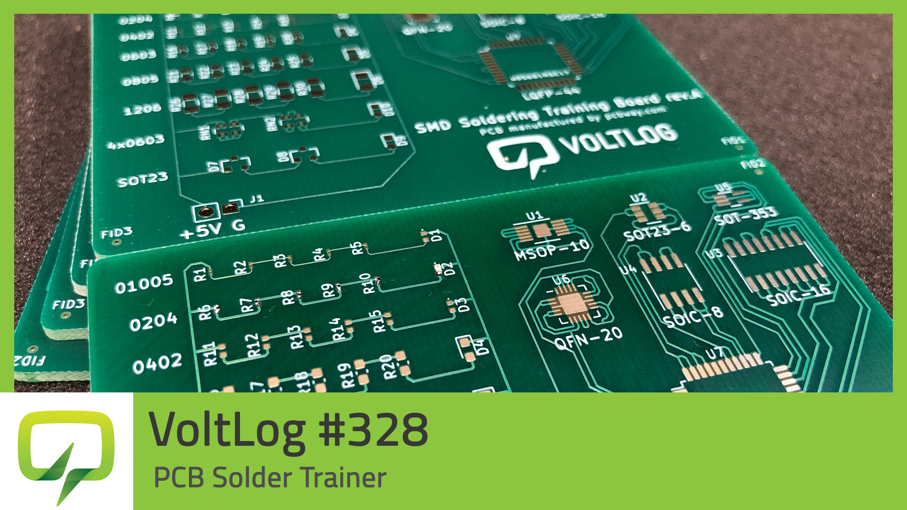

# SMD-Solder-Trainer
This repository holds source file for the Voltlog SMD Solder Trainer

I designed this PCB to help people test their SMD soldering skills. It contains passives from 01005 up to 1206 as well as several chip packages. If you solder all resistors in a row and the LED correctly, by applying 5V to the bottom header you should get a light on the LED. Although not entirely necessary, if you order this board with ENIG gold finish it should help with soldering the smallest pads.

Here is a list of tools & supplies that I used in this project:
* 2x3W Gooseneck Microscope Light http://voltlog.com/y/2gxc9
* Trinocular Microscope http://voltlog.com/y/tcmpe
* Hayear 1080P Camera http://voltlog.com/y/uh7pv
* 10” 2K HDMI Monitor http://voltlog.com/y/nq7rv
* KSGER T12 Soldering Station http://voltlog.com/y/2tzg7
* PCB files Kicad/Gerber (in this repository)

More info about this project in [Voltlog #328](https://youtu.be/IcV3Eh1Z-N4).

